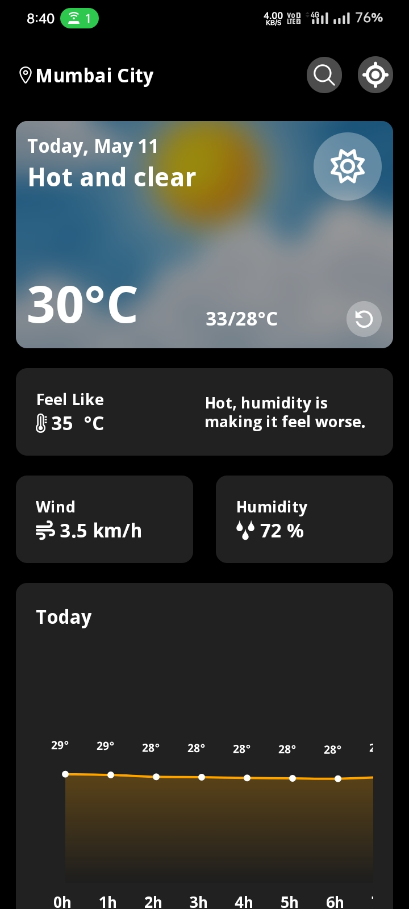
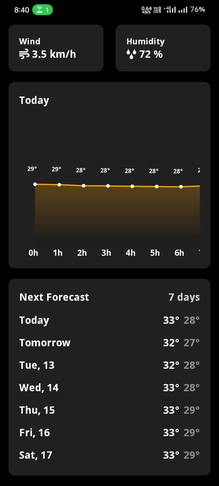

# Weather App

A beautiful and modern weather application built with React Native that provides real-time weather information with a sleek user interface.

## Features

- Real-time weather data
- Location-based weather updates
- Search functionality for any location
- 24-hour temperature forecast
- 7-day weather forecast
- Weather conditions visualization
- Detailed weather metrics (Temperature, Humidity, Wind, etc.)

## Screenshots

<!-- Add these screenshots to /home/kali/Desktop/WeatherApp/screenshots/ directory -->

<div style="display: flex; gap: 10px;">
    
    
</div>

## Installation

1. Clone the repository
```bash
git clone https://github.com/cd-lgn/WeatherApp.git
```

2. Install dependencies
```bash
cd WeatherApp
npm install
```

3. Run the app
```bash
# For Android
npm run android

# For iOS
cd ios && pod install && cd ..
npm run ios
```

## API Integration

This app uses two main APIs:
- OpenStreetMap API for location search
- Open-Meteo API for weather data

## Tech Stack

- React Native
- NativeWind (Tailwind CSS for React Native)
- React Native Gifted Charts
- React Native Vector Icons
- React Native Blur
- React Native Geolocation Service
- Axios for API calls
- dayjs for date handling

## Assets
The app uses two background images for day and night modes:
- `src/assets/sample1.jpg` - Day background
- `src/assets/sample2.jpg` - Night background

## Acknowledgments

- Weather data provided by Open-Meteo
- Location data provided by OpenStreetMap
- Icons from React Native Vector Icons
